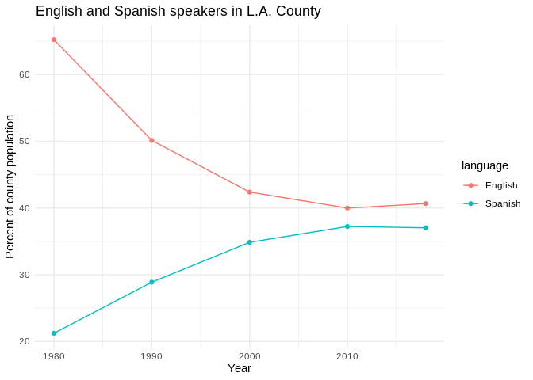
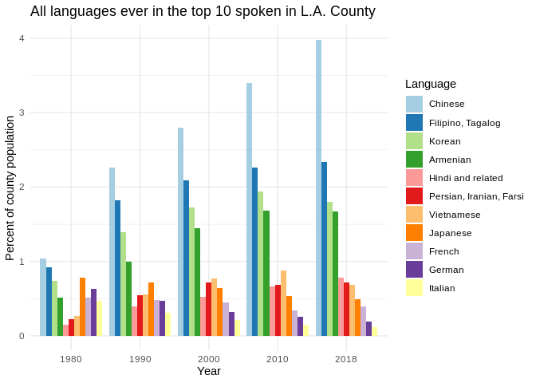
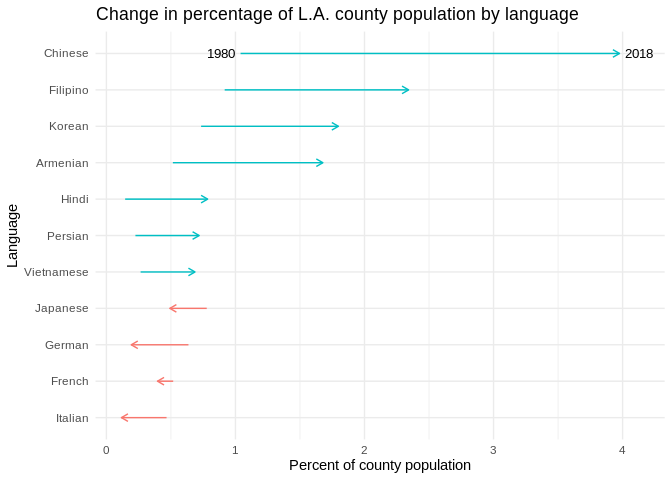

Analyzing L.A. County’s changing languages in Census microdata
================

**By [Ryan Menezes](https://twitter.com/ryanvmenezes/)**

This file goes over the data and R code used to analyze the changes in
L.A. County’s spoken languages for the Feb. 17, 2020 L.A. Times story on
[local libraries’ attempts to supply books in languages other than
English](https://www.latimes.com/la-me-libraries-languages-diversity-2019-story.html)
to an ever-changing population.

It uses the following R packages:

``` r
library(ipumsr)
library(tidyverse)
```

This analysis uses a custom microdata extract from IPUMS-USA. If you
need an introduction to microdata, I recommend this [excellent
write-up](https://source.opennews.org/articles/when-and-how-use-census-microdata/)
by Robert Gebeloff.

The data extract comes with two files:

1.  A fixed-width data file in a compressed folder
2.  A data codebook in an XML format, which describes the data based on
    the [Data Documentation Initative](https://ddialliance.org/), or
    “DDI”

The `ipumsr` package can read in both, provided they have equivalent
names.

``` r
ddi = read_ipums_ddi('data/usa_00011.xml')
data = read_ipums_micro(ddi)
```

    ## Use of data from IPUMS-USA is subject to conditions including that users should
    ## cite the data appropriately. Use command `ipums_conditions()` for more details.

## The codebook

The DDI details the variables in the extract:

``` r
info.variables = ddi$var_info
info.variables
```

    ## # A tibble: 14 x 10
    ##    var_name var_label var_desc val_labels code_instr start   end imp_decim
    ##    <chr>    <chr>     <chr>    <list>     <chr>      <dbl> <dbl>     <dbl>
    ##  1 YEAR     Census y… "YEAR r… <tibble [… <NA>           1     4         0
    ##  2 SAMPLE   IPUMS sa… "SAMPLE… <tibble [… <NA>           5    10         0
    ##  3 SERIAL   Househol… "SERIAL… <tibble [… "\nSERIAL…    11    18         0
    ##  4 CBSERIAL Original… "CBSERI… <tibble [… "\nCBSERI…    19    31         0
    ##  5 HHWT     Househol… "HHWT i… <tibble [… "\nHHWT i…    32    41         2
    ##  6 CLUSTER  Househol… CLUSTER… <tibble [… "\nCLUSTE…    42    54         0
    ##  7 STATEFIP State (F… "STATEF… <tibble [… <NA>          55    56         0
    ##  8 COUNTYF… County (… "COUNTY… <tibble [… "\nCOUNTY…    57    59         0
    ##  9 STRATA   Househol… "STRATA… <tibble [… "\nSTRATA…    60    71         0
    ## 10 GQ       Group qu… "GQ cla… <tibble [… <NA>          72    72         0
    ## 11 PERNUM   Person n… PERNUM … <tibble [… "\n\nPERN…    73    76         0
    ## 12 PERWT    Person w… "PERWT … <tibble [… "\nPERWT …    77    86         2
    ## 13 LANGUAGE Language… LANGUAG… <tibble [… <NA>          87    88         0
    ## 14 LANGUAG… Language… LANGUAG… <tibble [… <NA>          89    92         0
    ## # … with 2 more variables: var_type <chr>, rectypes <lgl>

The key column in this extract is
[LANGUAGE](https://usa.ipums.org/usa-action/variables/LANGUAGE), which
“reports the language that the respondent spoke at home, particularly
if a language other than English was spoken.”

The codebook provides the values for every LANGUAGED code:

``` r
info.variables %>% 
  filter(var_name == 'LANGUAGE') %>% 
  pull(val_labels) %>% 
  `[[`(1)
```

    ## # A tibble: 92 x 2
    ##      val lbl            
    ##    <dbl> <chr>          
    ##  1     0 N/A or blank   
    ##  2     1 English        
    ##  3     2 German         
    ##  4     3 Yiddish, Jewish
    ##  5     4 Dutch          
    ##  6     5 Swedish        
    ##  7     6 Danish         
    ##  8     7 Norwegian      
    ##  9     8 Icelandic      
    ## 10     9 Scandinavian   
    ## # … with 82 more rows

## The data

All of the data in the extract. Most of these come preselected with any
IPUMS extract.

``` r
data %>% head()
```

    ## # A tibble: 6 x 14
    ##    YEAR       SAMPLE SERIAL CBSERIAL  HHWT CLUSTER STATEFIP COUNTYFIP
    ##   <int>    <int+lbl>  <dbl>    <dbl> <dbl>   <dbl> <int+lb> <dbl+lbl>
    ## 1  1980 198001 [198… 192089       NA    20 1.98e12 6 [Cali…      2323
    ## 2  1980 198001 [198… 192089       NA    20 1.98e12 6 [Cali…      2323
    ## 3  1980 198001 [198… 192089       NA    20 1.98e12 6 [Cali…      2323
    ## 4  1980 198001 [198… 192089       NA    20 1.98e12 6 [Cali…      2323
    ## 5  1980 198001 [198… 192089       NA    20 1.98e12 6 [Cali…      2323
    ## 6  1980 198001 [198… 192090       NA    20 1.98e12 6 [Cali…      2323
    ## # … with 6 more variables: STRATA <dbl>, GQ <int+lbl>, PERNUM <dbl>,
    ## #   PERWT <dbl>, LANGUAGE <int+lbl>, LANGUAGED <int+lbl>

The data is already filtered down to California. Filter it down again to
just L.A. County, then keep only the relevant columns.

``` r
la.data = data %>% 
  filter(COUNTYFIP == 37) %>% 
  select(YEAR, LANGUAGE, PERWT)

la.data %>% head()
```

    ## # A tibble: 6 x 3
    ##    YEAR    LANGUAGE PERWT
    ##   <int>   <int+lbl> <dbl>
    ## 1  1980 1 [English]    20
    ## 2  1980 1 [English]    20
    ## 3  1980 1 [English]    20
    ## 4  1980 1 [English]    20
    ## 5  1980 1 [English]    20
    ## 6  1980 1 [English]    20

## Aggregating microdata into totals

Each line of a microdata file represents a person’s actual response to
the survey.
[PERWT](https://usa.ipums.org/usa-action/variables/PERWT#description_section)
is the approxmiation of how many people the line of data represents. It
needs to be aggregated and summed to get total counts for the language
for that year.

``` r
la.data.agg = la.data %>% 
  group_by(YEAR, LANGUAGE) %>% 
  summarise(PERWT = sum(PERWT))

la.data.agg %>% head()
```

    ## # A tibble: 6 x 3
    ## # Groups:   YEAR [1]
    ##    YEAR            LANGUAGE   PERWT
    ##   <int>           <int+lbl>   <dbl>
    ## 1  1980 0 [N/A or blank]     346500
    ## 2  1980 1 [English]         4888960
    ## 3  1980 2 [German]            47660
    ## 4  1980 3 [Yiddish, Jewish]   18900
    ## 5  1980 4 [Dutch]             13560
    ## 6  1980 5 [Swedish]            3780

This simple grouping and summing does **not** account for the margins of
error associated with the estimates, which are important to consider.
For those, I referred to [the result of the equivalent
query](data/query-la-county-all-languages.pdf) on the IPUMS online SDA
querying tool. The results of this microdata analysis and the SDA query
are nearly identical.

Next, reformat the data, separating the labels from the code, plus add
columns for the percent of the population speaking that language in each
year and the county rank for that year.

``` r
la.languages = la.data.agg %>% 
  group_by(YEAR) %>% 
  mutate(percent = PERWT / sum(PERWT)) %>% 
  # take out "N/A or blank" before calculating rank in year
  mutate(
    rankinyear = rank(
      desc(if_else(LANGUAGE != 0, percent, NA_real_)),
      na.last = 'keep',
      ties.method = 'min'
    )
  ) %>% 
  ungroup(YEAR) %>% 
  transmute(
    year = YEAR,
    langcode = zap_labels(LANGUAGE),
    language = as.character(as_factor(LANGUAGE)),
    total = PERWT,
    percent, rankinyear
  )

la.languages %>% head()
```

    ## # A tibble: 6 x 6
    ##    year langcode language          total  percent rankinyear
    ##   <int>    <int> <chr>             <dbl>    <dbl>      <int>
    ## 1  1980        0 N/A or blank     346500 0.0462           NA
    ## 2  1980        1 English         4888960 0.652             1
    ## 3  1980        2 German            47660 0.00636           7
    ## 4  1980        3 Yiddish, Jewish   18900 0.00252          12
    ## 5  1980        4 Dutch             13560 0.00181          16
    ## 6  1980        5 Swedish            3780 0.000504         28

A quick check to ground truth the data: If you sum up the totals by
year, does it come out to the county population over time?

``` r
la.languages %>% 
  group_by(year) %>% 
  summarise(total = sum(total))
```

    ## # A tibble: 5 x 2
    ##    year    total
    ##   <int>    <dbl>
    ## 1  1980  7495180
    ## 2  1990  8849529
    ## 3  2000  9523839
    ## 4  2010  9828277
    ## 5  2018 10103847

This looks [about
right](https://en.wikipedia.org/wiki/Demographics_of_Los_Angeles_County).
Populations will differ slightly based on these totals coming from
aggregating person-level responses, but we are close.

## Analysis

What were the top 10 languages spoken in 1980?

``` r
la.languages %>% 
  filter(year == 1980) %>% 
  arrange(rankinyear) %>% 
  head(10)
```

    ## # A tibble: 10 x 6
    ##     year langcode language            total percent rankinyear
    ##    <int>    <int> <chr>               <dbl>   <dbl>      <int>
    ##  1  1980        1 English           4888960 0.652            1
    ##  2  1980       12 Spanish           1591000 0.212            2
    ##  3  1980       43 Chinese             77920 0.0104           3
    ##  4  1980       54 Filipino, Tagalog   68700 0.00917          4
    ##  5  1980       48 Japanese            58280 0.00778          5
    ##  6  1980       49 Korean              55000 0.00734          6
    ##  7  1980        2 German              47660 0.00636          7
    ##  8  1980       11 French              38800 0.00518          8
    ##  9  1980       28 Armenian            38600 0.00515          9
    ## 10  1980       10 Italian             34940 0.00466         10

What were the top 10 languages spoken in 2018?

``` r
la.languages %>% 
  filter(year == 2018) %>% 
  arrange(rankinyear) %>% 
  head(10)
```

    ## # A tibble: 10 x 6
    ##     year langcode language                  total percent rankinyear
    ##    <int>    <int> <chr>                     <dbl>   <dbl>      <int>
    ##  1  2018        1 English                 4108477 0.407            1
    ##  2  2018       12 Spanish                 3741860 0.370            2
    ##  3  2018       43 Chinese                  401703 0.0398           3
    ##  4  2018       54 Filipino, Tagalog        236587 0.0234           4
    ##  5  2018       49 Korean                   181622 0.0180           5
    ##  6  2018       28 Armenian                 169458 0.0168           6
    ##  7  2018       31 Hindi and related         79249 0.00784          7
    ##  8  2018       29 Persian, Iranian, Farsi   72613 0.00719          8
    ##  9  2018       50 Vietnamese                69346 0.00686          9
    ## 10  2018       48 Japanese                  49664 0.00492         10

How have English and Spanish, far and away the top languages, changed
over time? (A version of this chart ran with the final story.)

``` r
plot.eng.esp.yearly = la.languages %>% 
  filter(language %in% c('English', 'Spanish')) %>% 
  ggplot(aes(year, percent * 100, color = language)) +
  geom_line() +
  geom_point() +
  xlab('Year') +
  ylab('Percent of county population') +
  ggtitle('English and Spanish speakers in L.A. County') +
  theme_minimal()

plot.eng.esp.yearly
```

<!-- -->

How about the other languages?

Start by keeping any language that has been in the top 10 for a
particular year.

``` r
ever.top.10 = la.languages %>% 
  filter(rankinyear <= 10) %>% 
  distinct(language) %>% 
  left_join(la.languages)

ever.top.10 %>% head()
```

    ## # A tibble: 6 x 6
    ##   language  year langcode   total percent rankinyear
    ##   <chr>    <int>    <int>   <dbl>   <dbl>      <int>
    ## 1 English   1980        1 4888960 0.652            1
    ## 2 English   1990        1 4436610 0.501            1
    ## 3 English   2000        1 4036798 0.424            1
    ## 4 English   2010        1 3930328 0.400            1
    ## 5 English   2018        1 4108477 0.407            1
    ## 6 German    1980        2   47660 0.00636          7

``` r
unique(ever.top.10$language)
```

    ##  [1] "English"                 "German"                 
    ##  [3] "Italian"                 "French"                 
    ##  [5] "Spanish"                 "Armenian"               
    ##  [7] "Chinese"                 "Japanese"               
    ##  [9] "Korean"                  "Filipino, Tagalog"      
    ## [11] "Persian, Iranian, Farsi" "Vietnamese"             
    ## [13] "Hindi and related"

This leaves 13 languages to look at more closely.

Let’s take out English and Spanish. How has the percentage of the
population speaking a particular language changed over time?

``` r
plot.lang.yearly.bars = ever.top.10 %>%
  # take out the two biggest
  filter(!language %in% c('English', 'Spanish')) %>% 
  arrange(-year, -total) %>% 
  # control ordering
  mutate(language = fct_inorder(language)) %>% 
  ggplot(aes(as_factor(year), percent * 100, fill = language)) +
  geom_bar(stat = 'identity', position = 'dodge') +
  scale_fill_brewer(palette = "Paired", name = 'Language') +
  xlab('Year') +
  ylab('Percent of county population') +
  ggtitle('All languages ever in the top 10 spoken in L.A. County') +
  theme_minimal()

plot.lang.yearly.bars
```

<!-- -->

What has the top 10 looked like over time?

``` r
plot.ranks.by.year = ever.top.10 %>%
  mutate(language = fct_inorder(language)) %>% 
  ggplot(aes(x = year, y = rankinyear, group = language)) +
  geom_hline(yintercept = 10.5, linetype = 2, alpha = 0.3) +
  geom_point(aes(size = total), color = 'grey') +
  geom_line(color = 'grey') +
  geom_point(
    data = . %>% filter(rankinyear > 4),
    aes(color = language, size = total)
  ) +
  geom_line(
    data = . %>% filter(rankinyear > 4),
    aes(color = language)
  ) +
  scale_x_continuous(
    limits = c(1980, 2021),
    breaks = c(1980, 1990, 2000, 2010, 2018),
    minor_breaks = NULL
  ) +
  scale_colour_brewer(palette = 'Paired') +
  scale_y_reverse(
    breaks = 1:10,
    limits = c(10,1),
    minor_breaks = NULL
  ) +
  theme_minimal() +
  theme(legend.position = 'none') +
  ylab('Rank in year') +
  xlab('') + 
  ggtitle('Top 10 languages spoken in L.A. County')

plot.top.10.by.year = plot.ranks.by.year +
  # annotate with names at end
  geom_text(
    data = . %>% group_by(language) %>% filter(rankinyear <= 10) %>% filter(year == max(year)),
    aes(year + 0.76, rankinyear, label = str_replace_all(word(language), ',', '')),
    hjust = 'left',
    size = 3
  )

plot.top.10.by.year
```

<!-- -->

How have these languages risen and fallen in and out of the top 10?

``` r
plot.top.10.rise.fall = plot.ranks.by.year +
  scale_y_reverse(
    breaks = 1:25,
    minor_breaks = NULL
  ) +
  # annotation
  geom_text(
    data = . %>% group_by(language) %>% filter(year == max(year)),
    aes(year + 0.76, rankinyear, label = str_replace_all(word(language), ',', '')),
    hjust = 'left',
    size = 3
  ) +
  ggtitle('All languages that have recently been in the top 10 for L.A. County')

plot.top.10.rise.fall
```

<!-- -->

Summarize the change in languages other than English and Spanish by
calculating the difference between now and 1980. (A version of this
chart ran with the final story.)

``` r
plot.change.1980.2018 = ever.top.10 %>% 
  filter(!language %in% c('English', 'Spanish')) %>%
  filter(year == 1980 | year == 2018) %>% 
  arrange(-total) %>% 
  select(language, year, percent) %>% 
  mutate(
    percent = percent * 100,
    language = word(language),
    language = str_replace_all(language, ',', ''),
    language = fct_rev(fct_inorder(language))
  ) %>% 
  ggplot(aes(x = percent, y = language)) +
  geom_segment(
    data = . %>%
      pivot_wider(names_from = year, values_from = percent) %>% 
      mutate(netgain = (`2018` - `1980`) > 0),
    aes(x = `1980`, xend = `2018`, y = language, yend = language, color = netgain),
    arrow = arrow(length = unit(0.2, "cm"))
  ) +
  geom_text(
    data = . %>% filter(language == 'Chinese' & year == 1980),
    aes(percent - 0.15, language, label = '1980'),
    size = 3.5
  ) +
  geom_text(
    data = . %>% filter(language == 'Chinese' & year == 2018),
    aes(percent + 0.15, language, label = '2018'),
    size = 3.5
  ) +
  theme_minimal() +
  theme(legend.position = 'none') +
  xlab('Percent of county population') +
  ylab('Language') +
  ggtitle('Change in percentage of L.A. county population by language')

plot.change.1980.2018
```

<!-- -->

Write out the cleaned file:

``` r
la.languages %>% write_csv('los-angeles-county-languages.csv', na = '')
```
